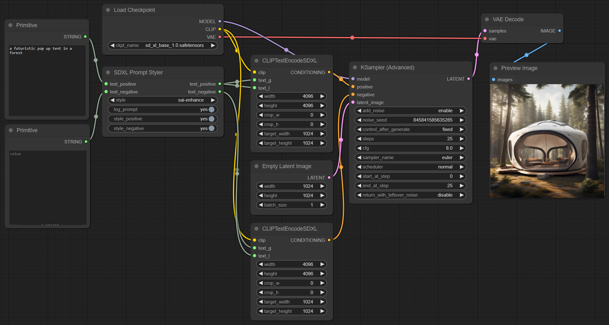
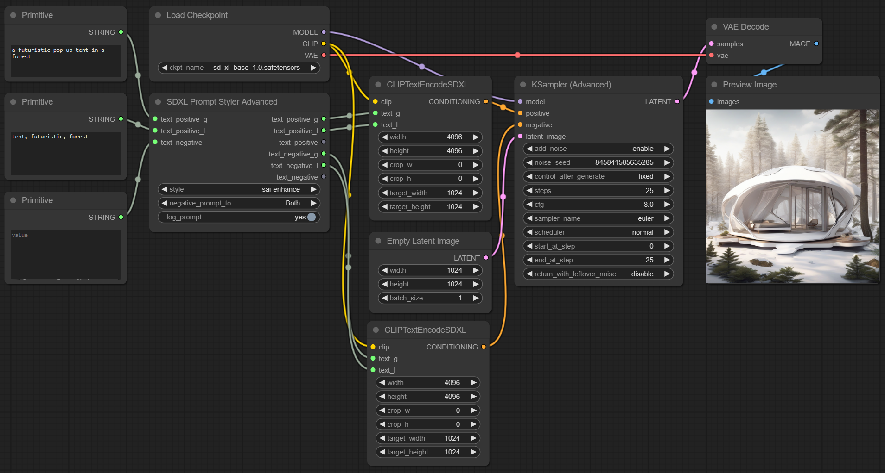

# SDXL Prompt Styler, a custom node for ComfyUI

### SDXL Prompt Styler


### SDXL Prompt Styler Advanced


SDXL Prompt Styler is a node that enables you to style prompts based on predefined templates stored in multiple JSON files. The node specifically replaces a {prompt} placeholder in the 'prompt' field of each template with provided positive text.

The node also effectively manages negative prompts. If negative text is provided, the node combines this with the 'negative_prompt' field from the template. If no negative text is supplied, the system defaults to using the 'negative_prompt' from the JSON template. This flexibility enables the creation of a diverse and specific range of negative prompts.

## Changelog
This section details the updates and new features committed over time, organized chronologically with the most recent changes at the top.

### Commit date (2023-08-27)

#### New Features

* **SDXL Prompt Styler Advanced**: New node for more elaborate workflows with lingustic and supportive terms. Selector to change the split behavior of the negative prompt. Special thanks to @WinstonWoof and @Danamir for their contributions!
* **SDXL Prompt Styler**: Minor changes to output names and printed log prompt.

### Commit date (2023-08-11)

#### Important Update
With the latest changes, the file structure and naming convention for style JSONs have been modified. If you've added or made changes to the `sdxl_styles.json` file in the past, follow these steps to ensure your styles remain intact:

1. **Backup**: Before pulling the latest changes, back up your `sdxl_styles.json` to a safe location.
2. **Migration**: After updating the repository, create a new JSON file in the styles directory. Move your custom styles from the backup of `sdxl_styles.json` into this new file.
3. **Unique Style Names**: While the system now detects duplicates and appends a suffix to ensure uniqueness, it's a best practice to ensure your style names are originally unique to prevent any potential confusion.
4. **Managing Included JSON Files**: If you prefer not to load specific included JSON files, consider renaming or moving them to a different location outside of the styles directory. The system will load all JSON files present in the specified directory.

#### New Features

* **Loading from Multiple JSON Files:** The system can now load styles from multiple JSON files present in the specified directory, ensuring the uniqueness of style names by appending a suffix to duplicates.
* **Enhanced Error Handling:** Improved error handling for file reading, data validity, and template replacement functions.

---

### Usage Example with SDXL Prompt Styler

Template example from a JSON file:

```json
[
    {
        "name": "base",
        "prompt": "{prompt}",
        "negative_prompt": ""
    },
    {
        "name": "sai-enhance",
        "prompt": "breathtaking {prompt} . award-winning, professional, highly detailed",
        "negative_prompt": "ugly, deformed, noisy, blurry, distorted, grainy"
    }
]
```

```python
style = "sai-enhance"
text_positive = "a futuristic pop up tent in a forest"
text_positive = "dark"
```

This will generate the following styled prompts as outputs:

```python
text_positive_styled = "breathtaking a futuristic pop up tent in a forest . award-winning, professional, highly detailed"
text_negative_styled = "ugly, deformed, noisy, blurry, distorted, grainy, dark"
```

### Installation

To install and use the SDXL Prompt Styler nodes, follow these steps:

1. Open a terminal or command line interface.
2. Navigate to the `ComfyUI/custom_nodes/` directory.
3. Run the following command:
```git clone https://github.com/twri/sdxl_prompt_styler.git```
4. Restart ComfyUI.

This command clones the SDXL Prompt Styler repository into your `ComfyUI/custom_nodes/` directory. You should now be able to access and use the nodes from this repository.

### Inputs

* **text_positive** - text for the positive base prompt
* **text_negative** - text for the negative base prompt
* **log_prompt** - print inputs and outputs to stdout

### Outputs

* **text_positive** - combined prompt with style for positive promt
* **text_negative** - combined prompt with style for negative promt